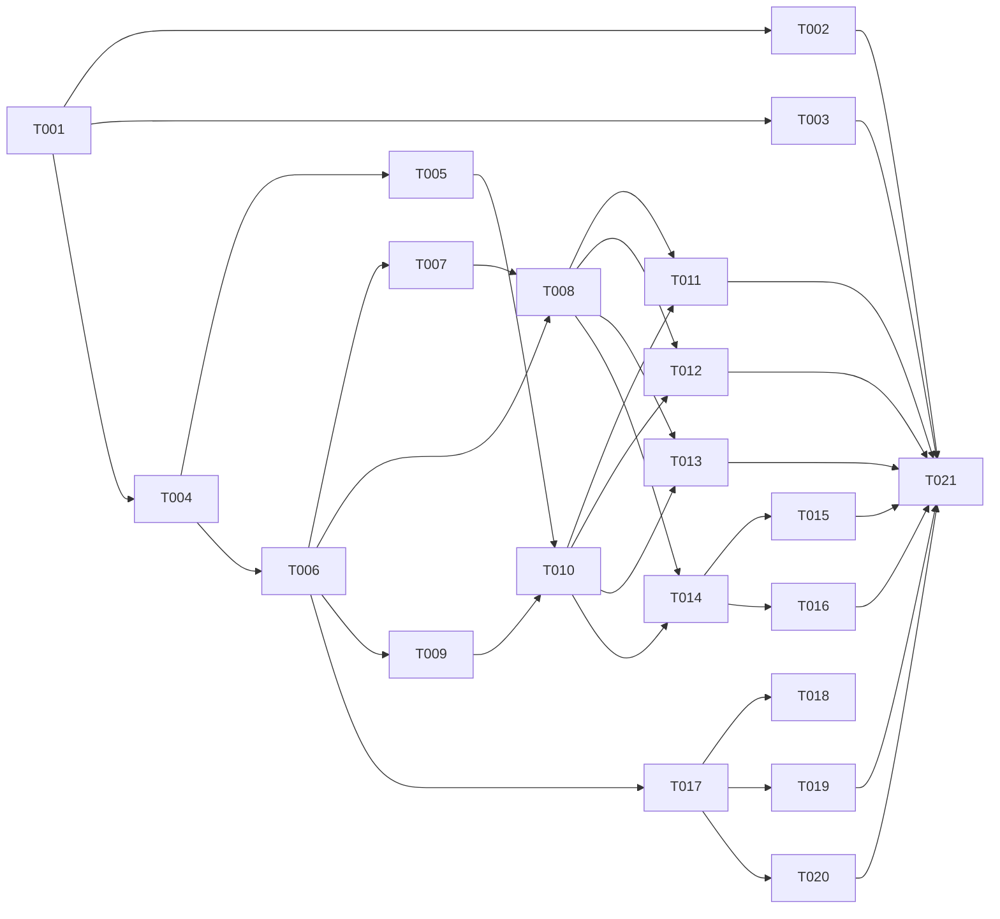

# Tasks: Local Server Transport

**Branch**: `014-docker-server-discovery` | **Date**: 2026-05-22 | **Spec**: [spec.md](spec.md)
**Input**: Design documents from `/specs/014-docker-server-discovery/`
**Prerequisites**: plan.md (required), spec.md (required for user stories), research.md, data-model.md, contracts/

**Tests**: Tests are excluded unless explicitly requested in the spec.

**Organization**: Tasks are grouped by user story to enable independent implementation and testing of each story. Each task is assigned to a specialist agent for domain-aware execution.

## Phase 1: Setup (Shared Infrastructure)

**Purpose**: Project initialization, basic structure, shared dependency installs

- [X] T001 [SETUP] Verify environment and review `specs/014-docker-server-discovery` artifacts before starting implementation
- [X] T002 [OPS] Modify `docker-compose.yml` in root to mount `/var/run/docker.sock` and set `pid: host` for dashboard service
- [X] T003 [OPS] Update `Dockerfile` to install `bash` and `docker-cli` in the final alpine stage
---

## Phase 2: Foundational (Blocking Prerequisites)

**Purpose**: Core infrastructure that MUST be complete before ANY user story can be implemented

**⚠️ CRITICAL**: No user story work can begin until this phase is complete (phase = sync barrier)
- [X] T004 [DB] Add `connectionType` column to `servers` table in `devops-app/server/db/schema.ts` (default 'ssh', include Zod enum validation)
- [ ] T005 [DB] Generate Drizzle migration for the new column (use `npm run db:generate` or write manually to `devops-app/server/db/migrations/0015_local_server_transport.sql` including the enum check constraint and index)
- [ ] T006 [BE] Create `devops-app/server/lib/constants.ts` defining and exporting the deterministic `LOCAL_SERVER_ID` UUID v5 constant and `isLocalServer()` helper
- [ ] T007 [BE] Create `devops-app/server/services/local-executor.ts` implementing `ClientChannelAdapter` and proxy local functions (`localExec`, `localExecStream`) with `maxBuffer: 50MB` and max 10 concurrent spawns semaphore
- [ ] T008 [BE] Modify `devops-app/server/services/ssh-pool.ts` to import `isLocalServer` and `local-executor.ts`, injecting the Proxy Pattern for `connect`, `exec`, `execStream`, `disconnect`, `isConnected`, and `openTunnel` when `serverId === LOCAL_SERVER_ID`

**Checkpoint**: Foundation ready — database is updated and transport abstraction is live.

---

## Phase 3: User Story 1 - Auto-discover Local Server (Priority: P1) 🎯 MVP

**Goal**: The dashboard automatically detects and displays the server it's running on so that I can manage my host without configuring SSH.

**Independent Test**: On startup, a "This Server" entry appears in the server list with status "online" and no SSH credentials required.

### Implementation for User Story 1

- [ ] T009 [BE] [US1] Create `devops-app/server/lib/local-server-seed.ts` to INSERT/DO NOTHING the local server row into DB (id: LOCAL_SERVER_ID, type: local, setupState: ready, status: online, aiWriteAccess: disabled)
- [ ] T010 [BE] [US1] Modify `devops-app/server/index.ts` to call the local server seed function during the startup sequence (after migrations, before ssh pool restore)
- [ ] T011 [BE] [US1] Modify `devops-app/server/lib/ensure-ssh.ts` to skip SSH connection attempts when `connectionType === 'local'` or `isLocalServer()`

**Checkpoint**: Application boots and the local server row is seeded automatically.

---

## Phase 4: User Story 2 & 3 - Execute Commands & Monitor Health Locally (Priority: P1)

**Goal**: Run scripts, deployments, and health polls on the local server without SSH overhead.

**Independent Test**: Health metrics for "This Server" populate successfully. Running a custom script returns expected output instantly.

### Implementation for User Story 2 & 3

- [ ] T012 [BE] [US2] Review `devops-app/server/services/health-poller.ts` to confirm no direct SSH-specific assertions block local polling (should work transparently via ssh-pool proxy)
- [ ] T013 [BE] [US2] Review `devops-app/server/services/ssh-executor.ts` and `scripts-runner.ts` to ensure compatibility with `ClientChannelAdapter` events from `localExecStream`

**Checkpoint**: Core command execution works.

---

## Phase 5: User Story 5 - Self-Protection (Priority: P1)

**Goal**: The dashboard protects itself from self-destructive operations so that I don't accidentally kill the dashboard while managing the local server.

**Independent Test**: Attempting to stop or remove the dashboard container from the UI is blocked with an error.

### Implementation for User Story 5

- [ ] T014 [BE] [US5] Create `devops-app/server/services/self-protection.ts` implementing container ID detection (via `/proc/1/cpuset` or `HOSTNAME`) and Docker command validation filtering
- [ ] T015 [BE] [US5] Integrate `self-protection.ts` into `devops-app/server/routes/docker.ts` endpoints (container list, stop, remove, kill) to inject `isSelf` flags and block destructive operations
- [ ] T016 [BE] [US5] Modify docker prune endpoints in `devops-app/server/routes/docker.ts` to exclude the self-container from aggressive/safe cleanup

**Checkpoint**: Destructive operations on the dashboard container are blocked.

---

## Phase 6: User Story 6 - UI Differentiation & API Guards (Priority: P2)

**Goal**: Visually distinguish the local server from SSH-connected servers and hide irrelevant SSH actions.

**Independent Test**: "This Server" shows a "Local" badge, and SSH credentials/rotate key/verify SSH actions are hidden. Deletion is blocked.

### Implementation for User Story 6

- [ ] T017 [BE] [US6] Modify `devops-app/server/routes/servers.ts` to block DELETE on `LOCAL_SERVER_ID`, and return 400 for verify/setup/rotate-key operations
- [ ] T018 [FE] [US6] Create `devops-app/client/components/servers/LocalBadge.tsx` component
- [ ] T019 [FE] [US6] Modify `devops-app/client/pages/DashboardPage.tsx` to render `LocalBadge` and disable delete button for `connectionType === 'local'`
- [ ] T020 [FE] [US6] Modify `devops-app/client/pages/ServerPage.tsx` to conditionally hide SSH credential fields, "Verify SSH", "Rotate Key", and onboarding wizards when `connectionType === 'local'`

**Checkpoint**: UI correctly reflects the local server state.

---

## Phase 7: Polish & Cross-Cutting Concerns

**Purpose**: Improvements that affect multiple user stories

- [ ] T021 [BE] Run `npm run typecheck` and `npm run lint` inside `devops-app` to ensure zero compilation or linting errors introduced

---

## Dependency Graph

### Legend

- `→` means "unlocks" (left must complete before right can start)
- `+` means "all of these" (join point — ALL listed tasks must complete)

### Dependencies

T001 → T002, T003, T004
T004 → T005, T006
T006 → T007, T008, T009, T017
T007 → T008
T005 + T009 → T010
T008 + T010 → T011, T012, T013, T014
T014 → T015, T016
T017 → T018, T019, T020
T002 + T003 + T011 + T012 + T013 + T015 + T016 + T019 + T020 → T021

---

## Dependency Visualization

> Auto-generated from Dependencies section above. For visual rendering in GitHub/VS Code only — NOT for parsing by the orchestrator.

---

## Parallel Lanes

| Lane | Agent Flow | Tasks | Blocked By |
|------|-----------|-------|------------|
| 1 | [SETUP] | T001 | — |
| 2 | [OPS] | T002, T003 | T001 |
| 3 | [DB] | T004 → T005 | T001 |
| 4 | [BE] (Core) | T006 → T007 → T008 | T004 |
| 5 | [BE] (Seed) | T009 → T010 → T011, T012, T013 | T006, (T005 for T010), (T008 for T011) |
| 6 | [BE] (Docker)| T014 → T015, T016 | T008, T010 |
| 7 | [BE] (API) | T017 | T006 |
| 8 | [FE] | T018, T019, T020 | T017 |
| 9 | [BE] (Polish)| T021 | All implementations |

---

## Agent Summary

| Agent | Task Count | Can Start After |
|-------|-----------|-----------------|
| [SETUP] | 1 | immediately |
| [OPS] | 2 | T001 |
| [DB] | 2 | T001 |
| [BE] | 12 | T004 |
| [FE] | 3 | T017 |

**Critical Path**: T001 → T004 → T006 → T009 → T010 → T014 → T015 → T021

---

## Implementation Strategy

### MVP First (User Story 1 Only)

1. Complete Phase 1 & 2 (Setup & Foundational)
2. Complete Phase 3 (US1 - Auto-seed and proxy bypass)
3. **STOP and VALIDATE**: Verify local server appears on boot and logs show no SSH connection attempts.

### Incremental Delivery

1. Follow dependency graph. `DB` starts first, then `BE` builds the proxy, followed by seeding.
2. `FE` can build the UI purely based on the API contract in `T017` concurrently with Docker self-protection logic.
3. Finish with a full typecheck compilation run.
