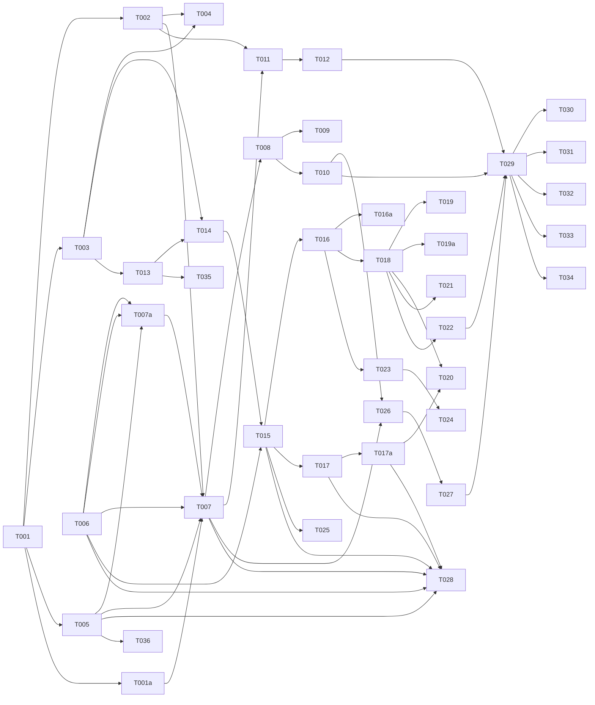

# Tasks: Amnezia VPN Integration & Server Management

**Input**: Design documents from `/specs/016-vpn-features/`
**Prerequisites**: plan.md (required), spec.md (required for user stories), research.md, data-model.md, quickstart.md

**Organization**: Tasks are grouped by user story to enable independent implementation and testing of each story. Each task is assigned to a specialist agent for domain-aware execution.

## Format: `[ID] [AGENT] [Story?] Description`

## Phase 1: Setup (Shared Infrastructure)

**Purpose**: Project initialization, feature-flag wiring, schema audit

- [ ] T001 [SETUP] Audit existing `servers`/`script_runs` schema in `devops-app/server/db/schema.ts` before extending. Confirm no breaking renames. Verify project configuration, environment variables, and Drizzle setup.
- [ ] T001a [OPS] Wire `FEATURE_VPN_ENABLED` env-flag check; mount VPN routes only when set. Default OFF in production.

---

## Phase 2: Foundational (Blocking Prerequisites)

**Purpose**: Core infrastructure that MUST be complete before ANY user story can be implemented

> **Note**: T002 and T003 both modify `server/db/schema.ts`. Must run sequentially in [DB] lane (T002 first, then T003).

- [ ] T002 [DB] Extend existing `servers` table — add `vpn_status` (text, default 'uninstalled'), `vpn_drift_status` (text, default 'unknown'), `vpn_installed_at` (text, nullable), `vpn_remove_on_delete` (boolean, default false), `scripts_enabled` (boolean, default false) columns via Drizzle migration. DO NOT redefine existing columns. Reuse `host`/`port`/`sshUser`/`sshPasswordEncrypted`/`sshPrivateKeyEncrypted`.
- [ ] T003 [DB] Create `scripts` and `script_params` tables only in `server/db/schema.ts` according to `data-model.md`. `Script` and execution records reuse existing `script_runs` table (Feature 005, `server/db/schema.ts:350`). No `scripts` table currently exists — this is a new table.
- [ ] T004 [DB] Generate Drizzle migration (`npm run db:generate`)
- [ ] T005 [BE] Wire VPN credential capture (T007) to existing envelope-cipher helper (`server/lib/envelope-cipher.ts`, Feature 011 pattern). Do NOT introduce a parallel AES scheme. Reuse `seal()`/`open()` with `DASHBOARD_MASTER_KEY`.

**Checkpoint**: Foundation ready — user story implementation can now begin

---

## Phase 3: User Story 1 - Add and Configure VPS (Priority: P1) 🎯 MVP

**Goal**: Allow users to add a new VPS or connect to an existing Amnezia VPN server by filling out a connection form, encrypting credentials, and initiating SSH connections.

**Independent Test**: Can be tested by filling out the connection form with test VPS credentials and verifying that the VPS is successfully added to the system and VPN installation is triggered.

### Implementation for User Story 1

- [ ] T006 [BE] [US1] Create `server/services/ssh.ts` to execute SSH connections and payloads using `ssh2`
- [ ] T007a [BE] [US1] Implement VPN install-detection probe — SSH to target, check whether Amnezia container/binaries already exist, set `vpn_status='installed'` and skip install branch when present. Required by FR-007.
- [ ] T007 [BE] [US1] Implement `POST /api/servers` and `GET /api/servers` endpoints in `server/routes/servers.ts`. Map form fields to existing schema columns (`host`, `sshUser`, `port`, `sshPasswordEncrypted`, `sshPrivateKeyEncrypted`). Wrap credential cleanup in try/finally when `storeCredentials=false` (FR-006).
- [ ] T008 [FE] [US1] Create React API client methods for servers in `client/src/services/`
- [ ] T009 [FE] [US1] Create `ServerForm.tsx` in `client/src/components/` mirroring Amnezia client fields (UI label: "Server Host / IP", "Username", "Password/Key", "SSH Port")
- [ ] T010 [FE] [US1] Create `ServerList.tsx` and integrate it into `client/src/pages/Servers/index.tsx`

**Checkpoint**: User Story 1 should be fully functional and testable independently

---

## Phase 4: User Story 2 - Delete Server (Priority: P1)

**Goal**: Allow users to delete a previously added server from the application's view so that obsolete or interfering servers do not clutter the interface.

**Independent Test**: Can be tested by adding a dummy server and then deleting it, verifying it is completely removed from the UI and backend data store.

### Implementation for User Story 2

- [ ] T011 [BE] [US2] Implement `DELETE /api/servers/:id` endpoint in `server/routes/servers.ts`
- [ ] T012 [FE] [US2] Add delete button with confirmation dialog in `ServerList.tsx`

**Checkpoint**: User Stories 1 AND 2 should both work independently

---

## Phase 5: User Story 4 - Script Executor (Priority: P1)

**Goal**: Allow users to execute any custom script from the script library on any server. Scripts are dual-sourced from filesystem and DB.

**Independent Test**: Can be tested by adding a script file to the scripts directory, verifying it appears in the UI script tree, selecting a server, and executing it.

### Implementation for User Story 4

- [ ] T013 [BE] [US4] Implement `server/services/script-parser.ts` — parse `# @param` AND `# @description` annotations from script content
- [ ] T014 [BE] [US4] Implement `server/services/script-indexer.ts` — scan `scripts/` dir, compute SHA-256 hashes, upsert into DB, parse params. On path collision between FS and DB sources, FS wins — overwrite the DB row's content and metadata, set `source='filesystem'`.
- [ ] T015 [BE] [US4] Implement `server/services/script-executor.ts` — execute script on server via SSH, pass params as env vars, stream output. Write remote script via `mktemp -p /tmp script.XXXXXX.sh`, chmod 700, register `trap rm -f $tmpfile EXIT` in the executed wrapper (prevents symlink attack).
- [ ] T016 [BE] [US4] Implement script API routes in `server/routes/scripts.ts`: `GET /api/scripts`, `GET /api/scripts/:id`, `POST /api/scripts`, `PUT /api/scripts/:id`, `DELETE /api/scripts/:id`, `POST /api/scripts/:id/execute`, `GET /api/scripts/executions/:executionId`, `POST /api/scripts/reindex`. Filesystem-sourced scripts return 403 on PUT/DELETE.
- [ ] T016a [BE] [US4] Add concurrent-execution counter per server; reject `POST /api/scripts/:id/execute` with 429 when >3 in-flight `script_runs`.
- [ ] T017 [BE] [US4] Add WebSocket endpoint `WS /ws/executions/:executionId` for real-time output streaming
- [ ] T017a [SEC] [US4] Enforce session-cookie auth and execution-ownership check on WS handshake. Close with 1008 on failure.
- [ ] T018 [FE] [US4] Create React API client methods for scripts in `client/src/services/`
- [ ] T019 [FE] [US4] Create `ScriptTree.tsx` — navigable tree component showing script hierarchy
- [ ] T019a [FE] [US4] Add "Re-scan" button in ScriptTree component that invokes `POST /api/scripts/reindex` and refreshes the tree. Satisfies SC-006 without requiring chokidar watcher.
- [ ] T020 [FE] [US4] Create `ScriptOutput.tsx` — real-time execution output display (WebSocket consumer)
- [ ] T021 [FE] [US4] Create `ScriptEditor.tsx` — create/edit custom scripts (DB-sourced only, `source='database'`)
- [ ] T022 [FE] [US4] Integrate ScriptTree + ScriptOutput into server detail page

**Checkpoint**: User Story 4 should be fully functional — any script can be executed on any server

---

## Phase 6: User Story 5 - Dynamic Script Options (Priority: P2)

**Goal**: Parse `@param` annotations from scripts and render dynamic form fields on the frontend.

**Independent Test**: Can be tested by creating a script with `@param` annotations and verifying the UI renders the correct form fields.

### Implementation for User Story 5

- [ ] T023 [FE] [US5] Create `ScriptForm.tsx` — dynamic form that renders fields from parsed `@param` annotations (string→text, number→number, boolean→checkbox, select:a,b,c→dropdown)
- [ ] T024 [FE] [US5] Integrate ScriptForm into script execution flow — pre-fill defaults, collect values, pass to execute API
- [ ] T025 [BE] [US5] Validate that env var passing works for all param types in `script-executor.ts`

**Checkpoint**: Script params render dynamically, values pass correctly as env vars

---

## Phase 7: User Story 3 - Drift Detection (Priority: P3)

**Goal**: Detect and alert when an active server's VPN configuration drifts from expected state.

**Independent Test**: Can be tested by stopping the VPN container on a remote host and verifying that the drift alert appears in the UI.

### Implementation for User Story 3

- [ ] T026 [OPS] [US3] Create a drift detection poller in `server/services/drift.ts` (polling active servers via SSH to check container status). Skip rows with both `sshPasswordEncrypted` and `sshPrivateKeyEncrypted` NULL; set their `vpn_drift_status='unknown'`.
- [ ] T027 [FE] [US3] Add Visual UI Alert indicator for drift status in `ServerList.tsx`

**Checkpoint**: User Stories 1, 2, 4, 5, AND 3 should all work independently

---

## Phase 8: Polish & Cross-Cutting Concerns

**Purpose**: Improvements that affect multiple user stories

- [ ] T028 [SEC] Security review of SSH credential encryption, envelope cipher usage, script execution, WS handshake auth + secret-leakage exposure via streamed stdout, symlink attack prevention
- [ ] T029 [OPS] Validate deployment and Quickstart instructions (`quickstart.md`)

---

## Phase 9: Testing

**Purpose**: E2E and unit test coverage for all user stories

- [ ] T030 [PERF] Validate SC-004 first-byte streaming latency (≤2 s from invoke to first stdout chunk)
- [ ] T031 [E2E] [US1] Test: add new VPS, verify VPN install triggers, verify form fields match spec
- [ ] T032 [E2E] [US2] Test: add then delete server, verify removal from UI + DB
- [ ] T033 [E2E] [US3] Test: drift detection — stop VPN container, verify alert appears
- [ ] T034 [E2E] [US4] Test: add script to filesystem, verify tree shows it, execute on server, verify real-time output
- [ ] T035 [TEST] [US5] Unit test: `script-parser.ts` regex — `@param` with defaults, colons in description, unsupported types, `@description` annotation
- [ ] T036 [TEST] Unit test: envelope-cipher integration for VPN credential seal/open round-trip

---

## Dependency Graph

### Dependencies

T001 → T002, T003, T005
T001 → T001a
T001a → T007
T002 → T004, T007, T011
T003 → T004, T014
T005 + T006 → T007a
T006 → T007a
T007a → T007
T005 + T006 → T007
T007 → T008
T008 → T009, T010
T007 → T011
T011 → T012
T003 → T013
T013 → T014
T014 + T006 → T015
T015 → T016, T017
T016 → T016a, T018
T017 → T017a
T017a → T020
T018 → T019, T019a, T020, T021, T022
T016 → T023
T023 → T024
T015 → T025
T007 + T010 → T026
T026 → T027
T005 + T006 + T007 + T015 + T017 + T017a → T028
T010 + T012 + T022 + T027 → T029
T029 → T030, T031, T032, T033, T034
T013 → T035
T005 → T036

### Self-Validation

T028 must PASS before `/speckit.implement` can begin (per constitution Principle VI).

---

## Dependency Visualization

---

## Parallel Lanes

| Lane | Agent Flow | Tasks | Blocked By |
|------|-----------|-------|------------|
| 1 | [SETUP] | T001, T001a | — |
| 2 | [DB] | T002 → T003 → T004 | T001 |
| 3 | [BE] | T005, T006 → T007a → T007 → T011; T013 → T014 → T015 → T016, T016a, T017, T017a, T025; T026 | T001, T002, T003 |
| 4 | [FE] | T008 → T009, T010 → T012; T018 → T019, T019a, T020, T021, T022; T023 → T024; T027 | T007, T016, T017, T026 |
| 5 | [OPS] | T029 | T010, T012, T022, T027 |
| 6 | [SEC] | T028 | T005, T006, T007, T015, T017, T017a |
| 7 | [TEST] | T030–T036 | T029, T013, T005 |

---

## Agent Summary

| Agent | Task Count | Can Start After |
|-------|-----------|-----------------|
| [SETUP] | 2 | immediately |
| [DB] | 3 | T001 |
| [BE] | 14 | T001, T002, T003 |
| [FE] | 13 | T007, T016, T017, T026 |
| [OPS] | 2 | T010, T012, T022, T027 |
| [SEC] | 1 | T005, T006, T007, T015, T017, T017a |
| [TEST] | 7 | T029, T013, T005 |

**Critical Path**: T001 → T003 → T014 → T015 → T016 → T018 → T022 → T029 → T034

---

## Implementation Strategy

### MVP First (User Story 1 Only)

1. Complete Phase 1 & 2
2. Complete Phase 3 (US1: T006 - T010)
3. STOP and VALIDATE independently.

### Incremental Delivery

1. Deliver US1 MVP.
2. Deliver US2 (Delete Server: T011, T012).
3. Deliver US4 (Script Executor: T013 - T022).
4. Deliver US5 (Dynamic Script Options: T023 - T025).
5. Deliver US3 (Drift Detection: T026, T027).
