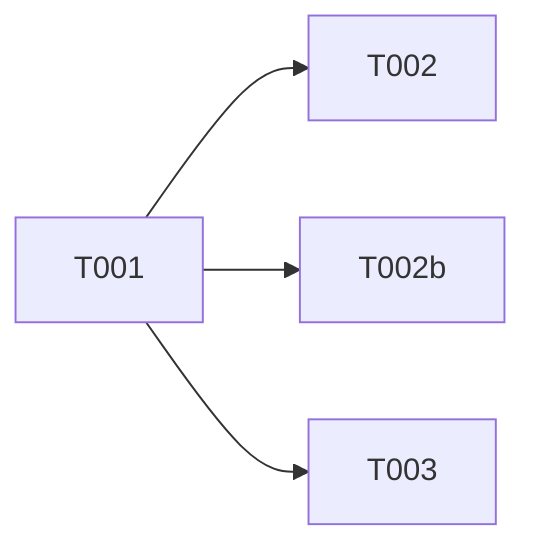

# Tasks: VPN Tab Deserialize Fix

**Input**: Design documents from `/specs/017-vpn-tab-deserialize-fix/`
**Prerequisites**: plan.md (required), spec.md (required)

## Phase 1: Fix (Single Change)

- [X] T001 [BE] Fix response shape in `server/routes/servers-vpn.ts:227` — change `res.json({ servers: rows })` to `res.json(rows)`

---

## Phase 2: Verification

- [X] T002 [BE] Verify VPN tab loads correctly with VPN-flagged servers. Code must use res.json(rows ?? []) — never pass potentially null/undefined rows directly
- [X] T002b [BE] Grep entire codebase for `/api/servers/vpn` consumers (server, client, scripts, tests). Confirm only `client/lib/vpn-api.ts` consumes this endpoint. If other consumers exist, update them to expect array
- [X] T003 [BE] Verify empty state renders gracefully when no VPN servers exist

---

## Dependency Graph

### Dependencies

T001 → T002, T002b, T003

### Self-Validation Checklist

> - [x] Every task ID in Dependencies exists in the task list above
> - [x] No circular dependencies
> - [x] No orphan task IDs
> - [x] Fan-in uses `+` only, fan-out uses `,` only
> - [x] No chained arrows on a single line

---

## Dependency Visualization

---

## Parallel Lanes

| Lane | Agent Flow | Tasks | Blocked By |
|------|-----------|-------|------------|
| 1 | [BE] | T001 → T002, T003 | — |

---

## Agent Summary

| Agent | Task Count | Can Start After |
|-------|-----------|-----------------|
| [BE] | 3 | immediately |

**Critical Path**: T001 → T002 (2 tasks)

---

## Implementation Strategy

### MVP First

1. Apply T001 — single line change
2. Verify T002 + T003
3. Done — ship immediately

### Strategy Selection

| Task Count | Coupling | Strategy |
|------------|----------|----------|
| 3 tasks | Low | Per-task dispatch |

---

## Notes

- This is a trivial one-line fix. No research.md, data-model.md, contracts/, or quickstart.md needed.
- SC-003 from spec: "The fix touches exactly one line in one file — no collateral changes."
- Client code (`vpn-api.ts`) is correct — the server is the source of the mismatch.
