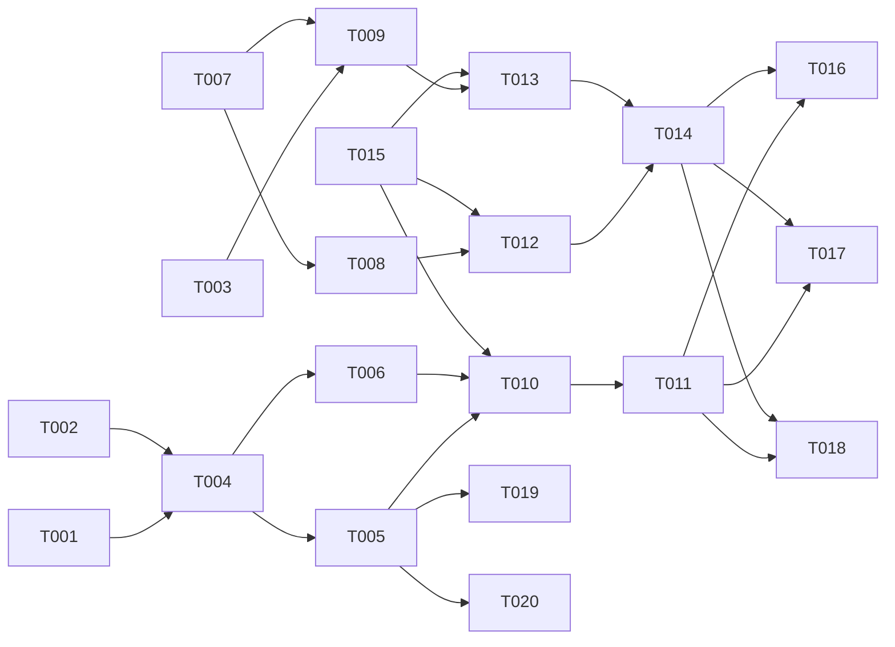

# Tasks: Amnezia VPN Install Completion

**Input**: Design documents from `/specs/018-amnezia-install-completion/`
**Prerequisites**: plan.md (required), spec.md (required), research.md, data-model.md, contracts/vpn-install.md

## Phase 1: Setup (Migration + Infrastructure)

**Purpose**: Database migration for VPN config storage, install script skeleton

- [ ] T001 [DB] Add `vpn_config_encrypted` and `vpn_config_format` columns to `servers` table — generate migration `.sql` file in `server/db/migrations/018-add-vpn-config-column.sql`
- [ ] T002 [BE] Create install script `server/scripts/install-amnezia.sh` — SSH-target script with stage markers: connecting, installing, configuring, extracting
- [ ] T003 [SETUP] Add `qrcode` npm dependency to server package (for QR code generation)

---

## Phase 2: Backend — Install Worker + API

**Purpose**: Worker that runs install script on remote server, API endpoints for trigger/status/config

- [ ] T004 [BE] Implement `server/workers/amnezia-installer.ts` — SSH worker that uploads install script, executes it, captures stage output, extracts config file via SCP, encrypts and stores in `vpn_config_encrypted`
- [ ] T005 [BE] Implement `POST /api/servers/:id/vpn/install` in `server/routes/servers-vpn.ts` — validate server exists, check no active deployments, trigger worker, return 202
- [ ] T006 [BE] Implement `GET /api/servers/:id/vpn/status` in `server/routes/servers-vpn.ts` — return current vpnStatus with stage detail
- [ ] T007 [BE] Implement `server/lib/vpn-config.ts` — config decryption helper, format detection, QR code generation

---

## Phase 3: Backend — Config Delivery

**Purpose**: Endpoints for downloading config file and QR code

- [ ] T008 [BE] Implement `GET /api/servers/:id/vpn/config` in `server/routes/servers-vpn.ts` — decrypt config, serve as downloadable file with correct Content-Disposition
- [ ] T009 [BE] Implement `GET /api/servers/:id/vpn/config/qr` in `server/routes/servers-vpn.ts` — decrypt config, generate QR code, return as data URL

---

## Phase 4: Frontend — Install UI

**Purpose**: User-facing components for triggering install and viewing progress

- [ ] T010 [FE] Implement `client/components/vpn/InstallButton.tsx` — trigger install via POST, show confirm dialog if VPN already installed (reinstall), poll status for progress stages
- [ ] T011 [FE] Add install trigger + progress display to server detail VPN section
- [ ] T012 [FE] Implement `client/components/vpn/ConfigDownload.tsx` — download button for .conf/.vpn file
- [ ] T013 [FE] Implement `client/components/vpn/ConfigQRCode.tsx` — display QR code modal for mobile scanning
- [ ] T014 [FE] Add config download + QR actions to server detail page when `vpnStatus="running"`

---

## Phase 5: Client API Layer

**Purpose**: React Query hooks for install API

- [ ] T015 [FE] Add `triggerInstall()`, `getInstallStatus()`, `downloadConfig()`, `getConfigQR()` to `client/lib/vpn-api.ts`

---

## Phase 6: Verification

- [ ] T016 [BE] Verify install flow end-to-end: trigger → stages → config extraction → status=running
- [ ] T017 [FE] Verify config download delivers valid .conf file importable by WireGuard client
- [ ] T018 [FE] Verify QR code is scannable by Amnezia mobile client
- [ ] T019 [BE] Verify error handling: SSH failure → status=error + retry available
- [ ] T020 [BE] Verify reinstall prompt: already-installed server shows confirmation dialog

---

## Dependency Graph

### Dependencies

T001 → T004
T002 → T004
T003 → T009
T004 → T005, T006
T005 → T010
T006 → T010
T007 → T008, T009
T008 → T012
T009 → T013
T010 → T011
T012 → T014
T013 → T014
T015 → T010, T012, T013
T011 + T014 → T016, T017, T018
T005 → T019, T020

### Self-Validation Checklist

> - [x] Every task ID in Dependencies exists in the task list above
> - [x] No circular dependencies
> - [x] No orphan task IDs
> - [x] Fan-in uses `+` only, fan-out uses `,` only
> - [x] No chained arrows on a single line

---

## Dependency Visualization

---

## Parallel Lanes

| Lane | Agent Flow | Tasks | Blocked By |
|------|-----------|-------|------------|
| 1 | [DB] | T001 | — |
| 2 | [SETUP] | T002, T003 | — |
| 3 | [BE] core | T004 → T005, T006, T007 → T008, T009 | T001, T002 |
| 4 | [FE] API | T015 | — |
| 5 | [FE] UI | T010 → T011, T012 → T014, T013 → T014 | T005, T006, T015 |
| 6 | [BE] verify | T016, T019, T020 | T005 |
| 7 | [FE] verify | T017, T018 | T014 |

---

## Agent Summary

| Agent | Task Count | Can Start After |
|-------|-----------|-----------------|
| [DB] | 1 | immediately |
| [SETUP] | 2 | immediately |
| [BE] | 7 | T001, T002 |
| [FE] | 6 | T015 (API layer), T005/T006 (BE endpoints) |
| verify | 5 | all implementation tasks |

**Critical Path**: T001 → T004 → T005 → T010 → T011 → T016 (6 tasks)

---

## Implementation Strategy

### MVP First (User Story 1)

1. T001 + T002 (migration + script) — parallel
2. T004 (worker) — core engine
3. T005 + T006 (trigger + status endpoints)
4. T015 + T010 + T011 (client API + install button)
5. T016 (verify end-to-end)
6. **STOP and VALIDATE**: Install works, status updates, config extracted

### Incremental Delivery

1. MVP → ship US1 (install + config extraction)
2. Add T008 + T012 + T014 + T017 (config download — US3)
3. Add T009 + T013 + T018 (QR code — US3)
4. Add T019, T020 (error handling + retry — US2)

---

## Notes

- Config encryption uses existing AES-256-GCM pattern — no new crypto code
- Install script must be idempotent — safe to re-run on partial install
- Worker pattern from Feature 016 is reused — no new worker infrastructure
- QR code generated server-side to avoid sending decrypted config to client when only QR needed
