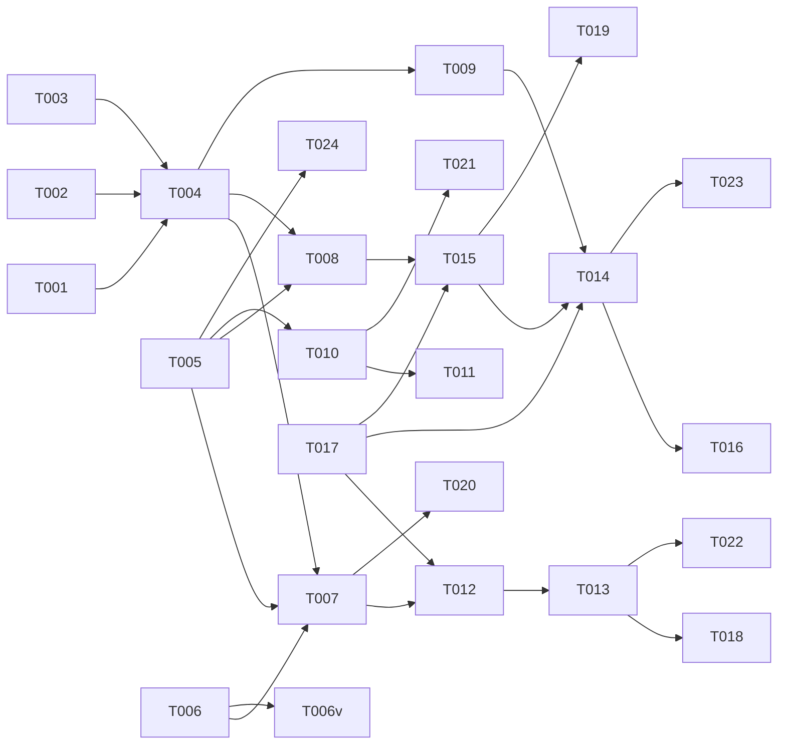

# Tasks: Server Soft-Delete with Grace Period

**Input**: Design documents from `/specs/019-server-soft-delete/`
**Prerequisites**: plan.md (required), spec.md (required), data-model.md, contracts/server-delete.md

## Phase 1: Database Setup

**Purpose**: Migration files for soft-delete column and audit entries table

- [ ] T001 [DB] Generate migration `server/db/migrations/019-add-deleted-at.sql` — add `deletedAt` column to `servers` table, create partial index `WHERE "deletedAt" IS NOT NULL` for archived view, drop existing unique constraints on `servers.ip` and `servers.name`, replace with partial unique indexes `idx_servers_ip_active ON servers(ip) WHERE "deletedAt" IS NULL` and `idx_servers_name_active ON servers(name) WHERE "deletedAt" IS NULL`
- [ ] T002 [DB] Generate migration `server/db/migrations/019-create-audit-entries.sql` — create `audit_entries` table with indexes
- [ ] T003 [DB] Update Drizzle schema in `server/db/schema.ts` — add `deletedAt` field to servers schema, add audit_entries schema

---

## Phase 2: Backend Core — Soft-Delete + Restore Logic

**Purpose**: Server-side logic for soft-delete, restore, and query filtering

- [ ] T004 [BE] Implement `server/services/server-deletion.ts` — `softDeleteServer(serverId, confirmName, actorId)`, `restoreServer(serverId, actorId)`, `getArchivedServers()`
- [ ] T005 [BE] Implement `server/lib/audit.ts` — `createAuditEntry({ actorType, actorId, action, resourceType, resourceId, resourceName, metadata })`
- [ ] T006 [BE] Add `deletedAt IS NULL` filter to ALL existing server list queries. Based on the application's server query audit, the following query locations MUST be updated (each is a subtask):
  - T006a: `GET /api/servers` (list all servers) — add `WHERE deletedAt IS NULL` to default list query
  - T006b: `GET /api/servers/:id` (server detail) — filter out soft-deleted servers (return 404 if `deletedAt IS NOT NULL` and caller is not admin)
  - T006c: `GET /api/servers/:id/apps` — exclude soft-deleted parent server from app listing
  - T006d: `GET /api/servers/:id/deploys` — exclude soft-deleted parent server from deploy listing
  - T006e: `GET /api/servers/:id/backups` — exclude soft-deleted parent server from backup listing
  - T006f: `GET /api/servers/:id/certs` — exclude soft-deleted parent server from cert listing
  - T006g: `GET /api/servers/:id/health` — exclude soft-deleted parent server from health checks
  - T006h: Any dashboard/summary aggregation queries (e.g., server count, server stats) — exclude soft-deleted
  - T006i: Any search/filter endpoints that query the `servers` table — exclude soft-deleted
  - NOTE: Admin endpoints and the archived-servers endpoint (`GET /api/servers/archived`) intentionally DO NOT apply this filter
- [ ] T006v [BE][SEC] Verification: After all T006a-T006i changes, grep the entire codebase for `from(servers)` / `serversTable` references that do NOT include `.where(isNull(deletedAt))` or equivalent. Confirm zero matches outside of admin/audit/archived endpoints. Document results in PR description
- [ ] T006j [BE] Audit ALL Drizzle `db.query.<entity>.findMany({ with: { server: ... } })` usages — list every call site, determine if soft-delete filter is needed
- [ ] T006k [BE] Audit ALL `.innerJoin/leftJoin(servers, ...)` patterns — list every call site, determine if soft-delete filter is needed
- [ ] T006l [BE] Apply `where: isNull(servers.deletedAt)` filters consistently to all relational queries and joins identified in T006j and T006k. Document the policy in code comments.
- [ ] T007 [BE] Modify `DELETE /api/servers/:id` in `server/routes/servers.ts` — accept `{ confirmName }` body, validate name match, check for active deployments, set `deletedAt`, create audit entry
- [ ] T008 [BE] Implement `POST /api/servers/:id/restore` in `server/routes/servers.ts` — clear `deletedAt`, create audit entry
- [ ] T009 [BE] Implement `GET /api/servers/archived` in `server/routes/servers.ts` — return soft-deleted servers with computed `remainingDays` and `approachingDeadline`

---

## Phase 3: Backend — Finalization Worker

**Purpose**: Background process for permanent deletion after grace period

- [ ] T010 [BE] Implement `server/workers/server-finalizer.ts` — select servers where `deletedAt < NOW() - 30 days`, cascade-delete in transaction, create audit entries, log results
- [ ] T010v [BE] Verify the 6 child tables (apps, deploys, backups, certs, health_checks, locks) all have `ON DELETE CASCADE` on their `server_id` FK. If any do not, the finalization worker must manually delete children in dependency order. Document findings in data-model.md.
- [ ] T011 [BE][SEC] Implement `POST /api/admin/finalize-deleted` in `server/routes/servers.ts` — admin endpoint to trigger finalization manually. MUST include: (1) admin role auth middleware check, (2) trigger finalization worker, (3) audit entry recording admin actor, timestamp, and count of finalized servers

---

## Phase 4: Frontend — Confirmation Modal

**Purpose**: GitHub-style name-typing confirmation for delete

- [ ] T012 [FE] Implement `client/components/servers/DeleteConfirmModal.tsx` — modal with name input, real-time validation, delete button disabled until match, warning text about 30-day grace period
- [ ] T013 [FE] Integrate DeleteConfirmModal into server list detail/actions — replace any existing delete button with soft-delete flow

---

## Phase 5: Frontend — Archived Servers View

**Purpose**: Archived servers panel with restore capability

- [ ] T014 [FE] Implement `client/components/servers/ArchivedServersList.tsx` — table with server name, deletion date, remaining days, approaching-deadline warning, restore action
- [ ] T015 [FE] Implement `client/components/servers/RestoreButton.tsx` — restore action with confirmation toast
- [ ] T016 [FE] Add archived servers route/page — accessible from sidebar or servers page navigation
- [ ] T017 [FE] Add `deleteServer()`, `restoreServer()`, `getArchivedServers()` to `client/lib/servers-api.ts`

---

## Phase 6: Verification

- [ ] T018 [BE] Verify soft-delete: delete server → confirm name → server disappears from active list → appears in archived
- [ ] T019 [BE] Verify restore: restore from archived → server returns to active list with all data intact
- [ ] T020 [BE] Verify active deployment block: attempt delete on server with active deploy → error message
- [ ] T021 [BE] Verify finalization: set `deletedAt` to 31 days ago → trigger finalization → server + related records permanently deleted → audit entry created
- [ ] T022 [BE] Verify name confirmation: wrong name → button disabled; correct name → button enabled
- [ ] T023 [FE] Verify archived panel: empty state when no deleted servers; correct remaining days display; approaching deadline highlight
- [ ] T024 [BE] Verify audit trail: delete, restore, finalize all produce correct audit entries with actor, timestamp, action type

---

## Dependency Graph

### Dependencies

T001 + T002 + T003 → T004
T004 → T007, T008, T009
T005 → T007, T008, T010
T006 → T007, T006v
T006 → T006j, T006k
T006j + T006k → T006l
T006l → T006v
T007 → T012
T008 → T015
T009 → T014
T010 → T011
T012 → T013
T014 → T016, T015 → T014 (composition: ArchivedServersList imports RestoreButton)
T017 → T012, T014, T015
T013 → T018, T022
T014 → T023
T015 → T019
T010 → T021
T005 → T024
T007 → T020

### Self-Validation Checklist

> - [x] Every task ID in Dependencies exists in the task list above
> - [x] No circular dependencies
> - [x] No orphan task IDs
> - [x] Fan-in uses `+` only, fan-out uses `,` only
> - [x] No chained arrows on a single line

---

## Dependency Visualization

---

## Parallel Lanes

| Lane | Agent Flow | Tasks | Blocked By |
|------|-----------|-------|------------|
| 1 | [DB] | T001, T002 → T003 | — |
| 2 | [BE] core | T005, T006 → T004 → T007, T008, T009 | T001-T003 |
| 3 | [BE] worker | T010 → T011 | T005 |
| 4 | [FE] API | T017 | — |
| 5 | [FE] UI delete | T012 → T013 | T007, T017 |
| 6 | [FE] UI archive | T015 → T014 → T016 | T008, T009, T017 |
| 7 | verify | T018-T024 | all implementation |

---

## Agent Summary

| Agent | Task Count | Can Start After |
|-------|-----------|-----------------|
| [DB] | 3 | immediately |
| [BE] | 8 | T001-T003 |
| [FE] | 6 | T017 (API), T007/T008 (endpoints) |
| verify | 7 | all implementation |

**Critical Path**: T001 → T003 → T004 → T007 → T012 → T013 → T018 (7 tasks)

---

## Implementation Strategy

### MVP First (User Story 1)

1. T001-T003 (database setup)
2. T005 (audit utility) + T006 (query filter)
3. T004 (deletion service) → T007 (delete endpoint)
4. T017 (client API) → T012 (modal) → T013 (integration)
5. T018, T020, T022 (verification)
6. **STOP and VALIDATE**: Soft-delete works with confirmation

### Incremental Delivery

1. MVP → ship US1 (soft-delete)
2. Add T008 + T015 + T014 + T016 (restore + archived view — US2 + US3)
3. Add T010 + T011 (finalization — US4)
4. Audit trail is built into each step (US5)

---

## Notes

- Confirmation modal follows GitHub pattern: type exact name to enable destructive action
- Finalization uses database transactions — partial cascades roll back on failure
- Audit entries are append-only — no update/delete operations
- `deletedAt IS NULL` filter must be added to ALL existing server queries (T006 is critical)
