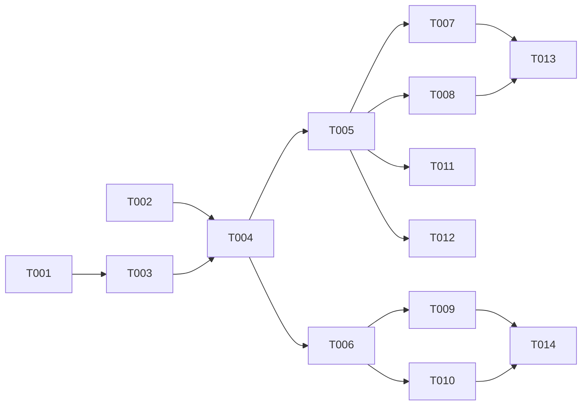

# Tasks: AI Copilot Custom OpenAI-Compatible Provider

**Input**: Design documents from `/specs/020-ai-custom-provider/`
**Prerequisites**: plan.md (required), spec.md (required), data-model.md, contracts/provider-config.md

## Phase 1: Database + Type Setup

**Purpose**: Migration and provider type extension

- [ ] T001 [DB] Generate migration `server/db/migrations/020-add-endpoint-url.sql` — add `endpointUrl` column to `ai_provider_keys`
- [ ] T002 [BE] Update provider type enum in `server/lib/provider-types.ts` — add `openai-compatible` type, update Zod validation schema: `apiKey: z.string().min(1).optional()` (optional for openai-compatible), require `endpointUrl` when type is `openai-compatible`. Include migration to make `api_key_encrypted` column nullable: `ALTER TABLE ai_provider_keys ALTER COLUMN api_key_encrypted DROP NOT NULL;`
- [ ] T003 [DB] Update Drizzle schema for `endpointUrl` column
- [ ] T006a [BE][SEC] Implement `server/lib/url-validator.ts` — URL denylist validator: block private IPv4 (10/8, 172.16/12, 192.168/16), link-local (169.254/16, fe80::/10), loopback (127/8, ::1), CGNAT (100.64/10). Resolve hostnames via `dns.promises.lookup` and check resolved IP. Comprehensive test suite covering all denylist ranges + DNS rebinding scenario
- [ ] T006b [BE] Integrate URL validator at provider config endpoint (POST/PATCH) — reject config with private/internal endpointUrl
- [ ] T006c [BE] Integrate URL validator at fetch-time wrapper — validate endpointUrl before every outbound AI API call, re-resolve hostname to catch DNS rebinding
- [ ] T006d [BE] Add `ALLOW_LOCAL_AI_ENDPOINTS` env var override — when true, allow local endpoints but emit audit entry per request

---

## Phase 2: Backend — Provider Factory

**Purpose**: Provider instantiation with custom baseURL

- [ ] T004 [BE] Update `server/services/ai-provider-factory.ts` — add `openai-compatible` case that creates OpenAI SDK instance with custom `baseURL`; update `anthropic` case to accept optional `baseURL`
- [ ] T005 [BE] Update provider CRUD routes in `server/routes/ai-providers.ts` — accept `endpointUrl` in create/update, validate URL format, pass to factory

---

## Phase 3: Backend — Test Connectivity

**Purpose**: Endpoint to verify custom provider connectivity

- [ ] T006 [BE] Implement `POST /api/ai/providers/:id/test` in `server/routes/ai-providers.ts` — instantiate provider with config, send minimal chat completion with payload "ping" using `max_completion_tokens: 5` (newer field, falls back to `max_tokens: 5` if 400 error). If both fail, attempt minimal stream-test (no max tokens). Goal: detect connectivity without breaking on quirky models (o1, structured outputs, etc.). Measure latency, return pass/fail.

---

## Phase 4: Frontend — Provider Settings

**Purpose**: UI for configuring custom provider

- [ ] T007 [FE] Add "Custom Base URL" field to `client/components/ai/ProviderSettings.tsx` — shown when type is `openai-compatible` (required) or `openai`/`anthropic` (optional); hidden for `ollama`
- [ ] T008 [FE] Add "OpenAI-Compatible" option to provider type selector
- [ ] T009 [FE] Implement `client/components/ai/ProviderTestButton.tsx` — test connectivity button with loading state, pass/fail result display with latency
- [ ] T010 [FE] Add `testProviderConnectivity()` to `client/lib/ai-api.ts` — React Query mutation for test endpoint

---

## Phase 5: Verification

- [ ] T011 [BE] Verify existing providers (OpenAI, Anthropic, Ollama) work without regression
- [ ] T012 [BE] Verify `openai-compatible` provider with a test endpoint (e.g., LM Studio or OpenRouter)
- [ ] T013 [FE] Verify provider settings form: shows endpointUrl for compatible types, hides for Ollama
- [ ] T014 [FE] Verify test connectivity: shows success with latency on valid provider, shows error on invalid

---

## Dependency Graph

### Dependencies

T001 → T003
T002 → T004
T002 → T006a
T006a → T006b, T006c
T006b → T005
T006c → T004
T006a → T006d
T003 → T004
T004 → T005, T006
T005 → T007, T008
T006 → T009, T010
T007 + T008 → T013
T009 + T010 → T014
T005 → T011, T012

### Self-Validation Checklist

> - [x] Every task ID in Dependencies exists in the task list above
> - [x] No circular dependencies
> - [x] No orphan task IDs
> - [x] Fan-in uses `+` only, fan-out uses `,` only
> - [x] No chained arrows on a single line

---

## Dependency Visualization

---

## Parallel Lanes

| Lane | Agent Flow | Tasks | Blocked By |
|------|-----------|-------|------------|
| 1 | [DB] | T001 → T003 | — |
| 2 | [BE] types | T002 | — |
| 3 | [BE] factory | T004 → T005, T006 | T001-T003 |
| 4 | [FE] API | T010 | T006 |
| 5 | [FE] UI | T007, T008, T009 | T005, T006 |
| 6 | verify | T011-T014 | implementation |

---

## Agent Summary

| Agent | Task Count | Can Start After |
|-------|-----------|-----------------|
| [DB] | 2 | immediately |
| [BE] | 5 | T001, T002 |
| [FE] | 4 | T005, T006 |
| verify | 4 | implementation |

**Critical Path**: T001 → T003 → T004 → T005 → T007 → T013 (6 tasks)

---

## Implementation Strategy

### MVP First (User Story 1 + 2 combined)

1. T001-T003 (DB + types)
2. T004 (factory) → T005 (CRUD)
3. T007 + T008 (UI form)
4. T011 + T012 (verify providers)
5. **STOP and VALIDATE**: Custom provider configurable and works

### Then Add Test Connectivity

6. T006 (test endpoint) → T009 + T010 (UI)
7. T013 + T014 (verify)

---

## Notes

- `@ai-sdk/openai` already supports custom `baseURL` — no new SDK needed
- Test connectivity sends a minimal request (max_tokens=1) to minimize cost
- Existing providers must have ZERO regression — test all three before shipping
- Azure OpenAI URL pattern may need special handling in the factory (document for user)
