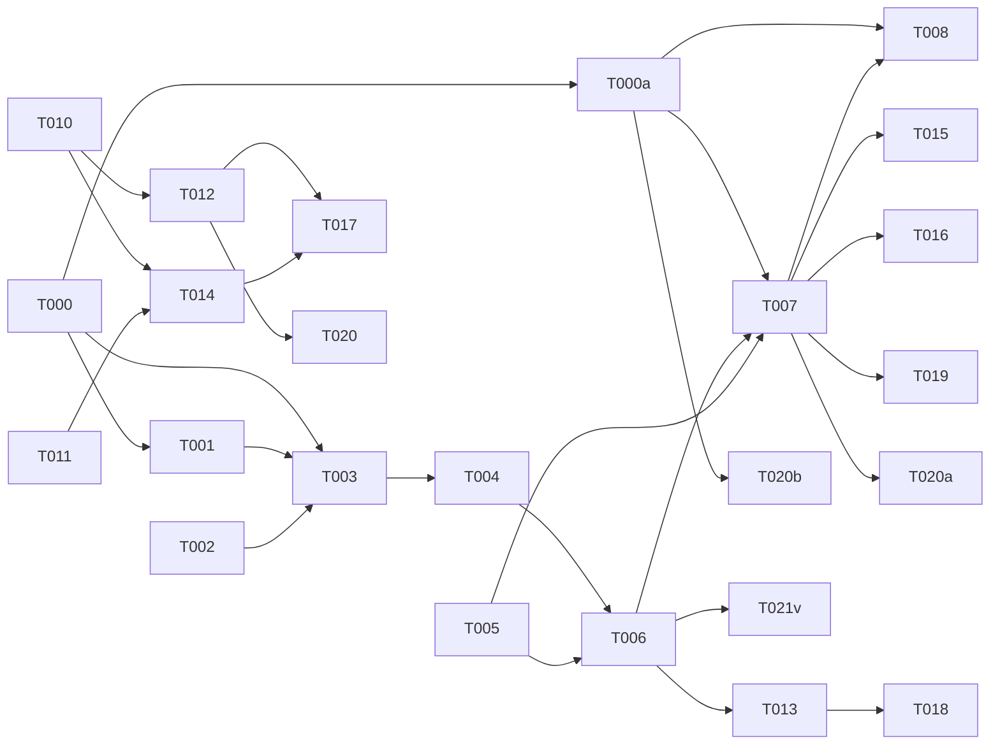

# Tasks: VPN/Server Unification

**Input**: Design documents from `/specs/021-vpn-server-unification/`
**Prerequisites**: plan.md (required), spec.md (required), research.md, data-model.md, contracts/unified-servers.md

**BLOCKS ON**: Feature 017 must be shipped before implementation begins.

## Phase 0: Pre-conditions

**Purpose**: Verify dependencies and introduce feature flag

- [ ] T000 [BE] Verify Feature 017 is merged to main — check `git log main --grep='017'` or equivalent. If not merged, abort all work and escalate.
- [ ] T000a [BE] Add feature flag `UNIFIED_SERVERS_API_ENABLED` to server config (env var, default: `false`). Create helper `isUnifiedApiEnabled()` used by route registration and client.

## Phase 1: Research — Kind Column Strategy

**Purpose**: Finalize kind column vs computed kind decision

- [ ] T001 [BE] Verify `servers` table schema — confirm VPN columns from Feature 016 exist, assess migration safety
- [ ] T002 [BE] Audit all consumers of `GET /api/servers/vpn` — ensure no external callers will break when route is removed

---

## Phase 2: Database — Kind Column

**Purpose**: Add kind column with backfill migration

- [ ] T003 [DB] Generate migration `server/db/migrations/021-add-server-kind.sql` — add `kind` column, backfill from `vpnStatus`, set NOT NULL + default + index
- [ ] T004 [DB] Update Drizzle schema in `server/db/schema.ts` — add `kind` field with enum type

---

## Phase 3: Backend — Unified Query Service

**Purpose**: Replace two query paths with one unified service

- [ ] T005 [BE] Create `server/lib/server-types.ts` — `ServerKind` enum, kind validation Zod schema
- [ ] T006 [BE] Create `server/services/server-queries.ts` — unified query builder accepting `{ kind: "all" | "vpn" | "general" }` parameter
- [ ] T007 [BE] Update `server/routes/servers.ts` — add `?kind=` query param to `GET /api/servers`, use unified query service. Kind transitions enforced via Zod discriminatedUnion: standard→vpn requires install flow trigger, vpn→standard requires explicit confirmation + transactional cleanup of all VPN fields (vpnConfig, vpnPubkey, vpnEndpoint, vpnInstalledAt). NO direct kind mutation endpoint.

---

## Phase 4: Backend — Deprecate VPN Router (dual-mode)

**Purpose**: Remove `servers-vpn.ts` route file, add deprecation redirect

- [ ] T008 [BE] Add deprecation header to `server/routes/servers-vpn.ts` — `Deprecation: true` + `Sunset` date header on all responses. Router stays registered during dual-mode period (flag-gated: if `UNIFIED_SERVERS_API_ENABLED=true`, VPN router still registered but client doesn't call it)
- [ ] T009 [BE] Retirement cleanup: after flag has been `true` for one release cycle, delete `server/routes/servers-vpn.ts` and remove registration from app startup. This is Phase 7 (post-graduation).

---

## Phase 5: Client — Unified React Query Hooks

**Purpose**: Replace two cache patterns with one parameterized key

- [ ] T010 [FE] Implement unified `useServers({ kind })` hook in `client/lib/servers-api.ts` — cache key `["servers", { kind }]`, fetches from unified endpoint
- [ ] T011 [FE] Delete VPN-specific hooks from `client/lib/vpn-api.ts` — merge any utility functions into `servers-api.ts`

---

## Phase 6: Client — Unified UI Components

**Purpose**: Merge form components, update VPN tab to filtered view

- [ ] T012 [FE] Update `client/components/servers/ServerList.tsx` — add kind filter dropdown (All / VPN / General), use unified hook
- [ ] T013 [FE] Merge server forms — unify `AddServerForm` and VPN `ServerForm` into single `ServerForm.tsx` with conditional fields based on `kind`. Use Zod `discriminatedUnion('kind', [standardServerSchema, vpnServerSchema])`. Frontend strips out-of-discriminator fields before submit. Backend re-validates with same discriminated union — rejects payloads with stale fields from the other variant.
- [ ] T014 [FE] Update `client/components/servers/VPNTab.tsx` — use `useServers({ kind: "vpn" })` instead of VPN-specific hook; render as filtered view of unified list

---

## Phase 7: Verification

- [ ] T015 [BE] Verify unified endpoint: `GET /api/servers` returns all, `?kind=vpn` returns VPN only, `?kind=general` returns general only
- [ ] T016 [BE] Verify old VPN route returns 404/410 — no zombie routes
- [ ] T017 [FE] Verify VPN tab parity: same data as filtering main list by "VPN"
- [ ] T018 [FE] Verify unified form: selecting "General" shows basic fields, "VPN" shows VPN fields
- [ ] T019 [BE] Verify kind filter validation: invalid value returns 400
- [ ] T020 [FE] Verify cache consistency: add server from main list → appears in VPN tab if VPN kind
- [ ] T020a [BE] Verify kind/vpnStatus synchronization: install VPN on a general server → confirm `kind` auto-updates to `vpn`; remove VPN → confirm `kind` reverts to `general`. Test via integration test.
- [ ] T020b [BE] Verify feature flag: with `UNIFIED_SERVERS_API_ENABLED=false`, old VPN router still handles requests; with flag `true`, unified endpoint is primary.
- [ ] T021v [BE][FE] **Extensibility spike**: implement a stub `kind=k8s` server type with form section + filter to validate that adding a new type requires changes to at most 3 files (schema enum, conditional form section, optionally a migration). Stub-only, do not merge. Document file change count in PR description. This validates SC-004.

---

## Dependency Graph

### Dependencies

T000 → T001, T003, T000a
T000a → T007, T008
T001 + T002 → T003
T003 → T004
T004 + T005 → T006
T006 → T007
T007 → T008
T005 → T007
T010 → T012, T014
T011 → T014
T013 → T018
T012 + T014 → T017
T007 → T015, T016, T019
T012 → T020
T007 → T020a
T000a → T020b
T006 → T021v, T013

### Self-Validation Checklist

> - [x] Every task ID in Dependencies exists in the task list above
> - [x] No circular dependencies
> - [x] No orphan task IDs
> - [x] Fan-in uses `+` only, fan-out uses `,` only
> - [x] No chained arrows on a single line

---

## Dependency Visualization

---

## Parallel Lanes

| Lane | Agent Flow | Tasks | Blocked By |
|------|-----------|-------|------------|
| 0 | [BE] pre-conditions | T000, T000a | — |
| 1 | [BE] research | T001, T002 | T000 |
| 2 | [DB] | T003 → T004 | T001, T002 |
| 3 | [BE] core | T005 → T006 → T007 → T008 | T004, T000a |
| 4 | [FE] API | T010, T011 | — |
| 5 | [FE] UI | T012, T013, T014 | T010, T011, T006 |
| 6 | verify | T015-T020, T020a, T020b, T021v | implementation |

---

## Agent Summary

| Agent | Task Count | Can Start After |
|-------|-----------|-----------------|
| [BE] | 10 | T000 → T000a |
| [DB] | 2 | T000, T001, T002 |
| [FE] | 5 | T010, T011, T006 |
| verify | 9 | implementation |

**Critical Path**: T000 → T001 → T003 → T004 → T006 → T007 → T015 (7 tasks)

---

## Implementation Strategy

### MVP First (User Story 1)

1. T001, T002 (research)
2. T003-T005 (DB + types)
3. T006-T007 (unified query + route)
4. T010-T012 (unified client hooks + list UI)
5. T015, T016 (verify unified endpoint)
6. **STOP and VALIDATE**: Unified list works with kind filter

### Then Continue

7. T008, T009 (retire VPN router)
8. T011, T014 (VPN tab as filtered view)
9. T013 (unified form)
10. T017-T020 (verify parity + cache)

---

## Notes

- **Hard dependency on Feature 017** — VPN tab must work before this refactor starts
- Client hard cutover: remove old hooks in same commit that adds unified hooks
- VPN router deletion is intentional — no backward compatibility period needed for internal API
- Adding future server types should touch exactly 3 files: enum, migration, form — verify with test
