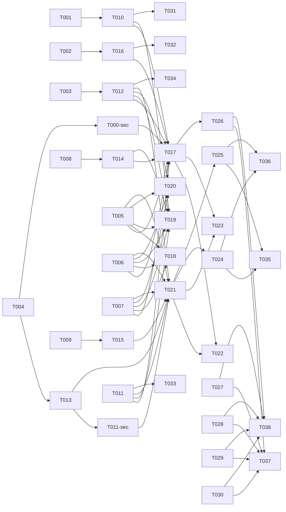

# Tasks: Script System Unification

> [!CAUTION]
> **STATUS: BLOCKED on security pass**
>
> This task list MUST NOT be executed until the [SECURITY-PASS-REQUIRED] section
> in spec.md is reviewed and signed off. See spec.md `[SECURITY-PASS-REQUIRED]`
> section for the 4 security vectors that must be closed first.

**Input**: Design documents from `/specs/022-script-system-unification/`
**Prerequisites**: plan.md (required), spec.md (required), research.md, data-model.md, contracts/scripts-crud.md

---

## Phase 0: Security Review (BLOCKED — MUST complete before Phase 2+)

**Purpose**: Close all 4 security vectors before any implementation begins

- [ ] T001 [SEC] [SECURITY] **Multi-layer Content Scanner for Dangerous Bash Patterns** — Define and validate a 4-layer defense strategy: (1) shell unescape preprocessor for hex/octal/ANSI-C/Unicode normalization, (2) AST-based analysis using `bashlex` or `tree-sitter-bash` for variable indirection and dynamic command detection, (3) regex denylist on normalized content (rm -rf /, curl | bash, eval/exec with variables, fork bombs, base64 decode exec, network exfiltration), (4) indirection denylist (variable expansion in command position, printf command construction, declare/typeset abuse). Produce confirmed multi-layer pattern list signed off by security reviewer. Fail-closed: AST parse failure = reject script.
- [ ] T001a [SEC] Evaluate AST parser options: `bashlex` (Python subprocess) vs `tree-sitter-bash` (Node native/WASM). Recommend one based on: parse accuracy for obfuscated scripts, integration complexity, performance, maintenance status. Document choice in security review.
- [ ] T001b [SEC] Define shell unescape preprocessor spec: list all escape forms to handle (hex, octal, ANSI-C, Unicode homoglyphs, `$'...'` strings). Confirm coverage of known obfuscation techniques.
- [ ] T001c [SEC] Define indirection denylist: enumerate all bash constructs that enable dynamic dispatch (variable expansion in command position, `printf`-constructed commands, `declare -f` abuse, associative array dispatch, `alias` abuse).
- [ ] T002 [SEC] [SECURITY] **`VPN_SCRIPTS_ROOT` Writability RBAC** — Define and validate filesystem permission policy: directory owned by deploy user, permissions 755 or stricter, startup check with refusal to start if insecure. Produce confirmed permission policy signed off by security reviewer.
- [ ] T003 [SEC] [SECURITY] **Arbitrary Script Upload RBAC** — Define and validate RBAC policy: admin-only upload/update/delete, audit every event with actor identity, SHA-256 hash at rest (signing deferred to v2), hash verification at execution. Produce confirmed RBAC policy signed off by security reviewer.
- [ ] T004 [SEC] [SECURITY] **Sandboxed Execution Technology** — Evaluate and select sandboxing technology (firejail recommended, bubblewrap alternative). Validate kernel requirements, produce default-deny profile, document minimum kernel version. Produce chosen technology with justification signed off by security reviewer.
- [ ] T000-sec [BE][SEC] Pre-flight sandbox availability check at server startup. If firejail/bubblewrap is not installed, log critical error and disable script execution endpoints (return 503 on execute). Document in deployment docs.
- [ ] T011-sec [BE][SEC] Every script execution attempt verifies sandbox is functional (quick test) before launching real workload. If verification fails, abort with 503 + audit entry.

**Phase 0 gate**: All 4 tasks MUST reach `[X]` with signed-off documents before Phase 2 begins. Phase 1 (data model + contracts) may proceed in parallel with security review.

---

## Phase 1: Database + Type Setup (RUNNABLE — parallel with security review)

**Purpose**: Schema and type definitions — no security-sensitive code

- [ ] T005 [DB] Generate migration `server/db/migrations/022-create-scripts.sql` — create `scripts` table with JSONB parameter_schema column
- [ ] T006 [DB] Generate migration `server/db/migrations/022-create-script-audit.sql` — create `script_audit_entries` table with indexes
- [ ] T007 [DB] Update Drizzle schema in `server/db/schema.ts` — add `scripts` and `script_audit_entries` schemas
- [ ] T008 [BE] Create `server/lib/script-types.ts` — TypeScript types for Script, ScriptParameterSchema, AuditEntry, ScriptSource enum
- [ ] T009 [SETUP] Add ajv and ajv-formats npm dependencies to server package (for runtime JSON Schema validation). zod-to-json-schema may be needed for one-time migration only (T022) — add as devDependency if needed.

---

## Phase 2: Security Services (BLOCKED on Phase 0 sign-off)

**Purpose**: Implement the 4 security vectors as standalone services

- [ ] T010 [BE][SEC] Implement `server/services/script-scanner.ts` — advisory pattern scanner: multi-layer detection (unescape + AST + regex + indirection) but advisory-only — warns admin on upload, does NOT block upload or execution. Returns specific warning descriptions with layer identification. The sandbox (T013) is the sole security boundary.
- [ ] T011 [BE] Implement `server/services/script-integrity.ts` — SHA-256 hash computation at upload, hash verification before execution, mismatch → block + audit entry
- [ ] T012 [BE] Implement `server/middleware/script-rbac.ts` — admin-only check on upload/update/delete endpoints, audit every CRUD event with actor identity
- [ ] T013 [BE] Implement `server/services/script-executor.ts` — sandboxed execution engine using chosen technology from T004. Default-deny profile. **MUST fail-closed: if sandbox initialization fails, execution is blocked (see FR-008).** No fallback to unsandboxed execution.

---

## Phase 3: Core Services (BLOCKED on Phase 2)

**Purpose**: Parser, JSON Schema conversion, startup permission check

- [ ] T014 [BE] Implement `server/services/script-parser.ts` — `# @param` annotation parser → JSON Schema conversion, support string/number/boolean/enum types with defaults
- [ ] T015 [BE] Implement `server/lib/ajv-validator.ts` — ajv-based JSON Schema validator. Compiles stored JSON Schema at execution time, validates user params, returns structured errors. No eval, no Zod for dynamic schemas.
- [ ] T016 [BE] Implement `VPN_SCRIPTS_ROOT` startup check — verify directory permissions (not world-writable), log permission check result, refuse to start if insecure (from T002 policy)

---

## Phase 4: API Endpoints (BLOCKED on Phase 3)

**Purpose**: Script CRUD + execute routes

- [ ] T017 [BE] Implement `POST /api/scripts/upload` in `server/routes/scripts.ts` — multipart upload, scanner check (T010), hash computation (T011), parse params (T014), store in DB, audit (T012)
- [ ] T018 [BE] Implement `GET /api/scripts` in `server/routes/scripts.ts` — list all scripts with parameter schema
- [ ] T019 [BE] Implement `PUT /api/scripts/:id` in `server/routes/scripts.ts` — admin-only update, re-scan on content change, re-hash, update parameter schema
- [ ] T020 [BE] Implement `DELETE /api/scripts/:id` in `server/routes/scripts.ts` — admin-only delete, remove file from disk, audit entry
- [ ] T021 [BE] Implement `POST /api/scripts/:id/execute` in `server/routes/scripts.ts` — validate params via ajv (T015), verify hash (T011), execute in sandbox (T013), return stdout/stderr/exit code, audit execution

---

## Phase 5: Legacy Migration (BLOCKED on Phase 4)

**Purpose**: Migrate Feature 005 + Feature 016 scripts into unified table

- [ ] T022 [BE] One-time CLI migration: create node scripts/migrate-feature-005-to-jsonschema.mjs — reads Feature 005 hardcoded Zod schemas, converts each to JSON Schema via zod-to-json-schema (this IS a legitimate use of the package — at MIGRATION time only, not runtime), persists rows to scripts table with source='feature-005-zod'. Run by admin manually, not as part of startup.
- [ ] T023 [BE] Migrate Feature 016 # @param DB scripts — parse existing # @param annotations → JSON Schema using the unified parser (T014), insert into scripts table with source='feature-016'. These scripts already have # @param annotations, so the parser is reused directly.
- [ ] T024 [BE] Deprecate Feature 005 script registration code as primary — redirect hardcoded script execution through unified system. Original registration code RETAINED as fallback (not deleted). Scripts with `source='feature-005'` use unified path; if unified path fails, fallback to original Feature 005 registration.
- [ ] T025 [BE] Deprecate Feature 016 `# @param` direct execution as primary — redirect through unified system. `# @param` parser RETAINED as fallback per FR-009. If unified parser fails, fallback to original `# @param` parsing.

---

## Phase 6: Frontend (BLOCKED on Phase 4)

**Purpose**: UI for script management and execution

- [ ] T026 [FE] Implement `client/components/scripts/ScriptUpload.tsx` — admin-only upload form, scanner feedback (show violations), parameter preview
- [ ] T027 [FE] Implement `client/components/scripts/ScriptLibrary.tsx` — script list with RBAC-aware actions (admin: edit/delete; all: execute)
- [ ] T028 [FE] Implement `client/components/scripts/ScriptExecuteForm.tsx` — dynamic form generated from JSON Schema parameters, validate inputs client-side
- [ ] T029 [FE] Implement `client/components/scripts/ScriptResult.tsx` — display stdout, stderr, exit code, sandbox status, duration
- [ ] T030 [FE] Add script CRUD + execute hooks to `client/lib/scripts-api.ts` — upload, list, update, delete, execute

---

## Phase 7: Verification (BLOCKED on Phase 5 + Phase 6)

- [ ] T031 [SEC] Verify scanner rejects ALL dangerous patterns (100% rejection rate for denylist)
- [ ] T031a [SEC] Verify multi-layer scanner: (1) unescape preprocessor catches hex/octal/ANSI-C obfuscation, (2) AST analysis catches variable indirection and dynamic commands, (3) indirection denylist catches obfuscation patterns. Test with crafted evasion scripts.
- [ ] T032 [SEC] Verify `VPN_SCRIPTS_ROOT` startup check: world-writable dir → app refuses to start
- [ ] T033 [SEC] Verify integrity check: modify script file → execution blocked + audit entry
- [ ] T034 [SEC] Verify RBAC: non-admin upload rejected; non-admin execute succeeds; admin upload succeeds
- [ ] T035 [BE] Verify Feature 005 scripts run identically through unified system (zero regression)
- [ ] T036 [BE] Verify Feature 016 scripts run identically through unified system (zero regression)
- [ ] T037 [BE] Verify script upload → parse → execute end-to-end with dynamic form
- [ ] T038 [FE] Verify script library shows all scripts with correct RBAC actions per user role
- [ ] T038v [BE] **ajv validation test**: For each supported JSON Schema construct (string, number, boolean, enum, array, object, nested), validate that ajv correctly validates and rejects inputs. Test all constraints (min/max, pattern, format, required/optional). Confirm no eval is involved — pure ajv compilation.

---

## Dependency Graph

### Dependencies

T001 + T001a + T001b + T001c → T010
T002 → T016
T003 → T012
T004 → T013
T004 → T000-sec
T000-sec → T017
T013 → T011-sec
T011-sec → T021
T005 + T006 + T007 → T017, T018, T019, T020, T021
T008 → T014
T009 → T015
T010 → T017, T019
T011 → T017, T019, T021
T012 → T017, T019, T020, T021
T013 → T021
T014 → T017, T019
T015 → T021
T016 → T017
T017 → T022, T023, T026
T021 → T022, T023, T024, T025
T024 + T025 → T035, T036
T026 + T027 + T028 + T029 + T030 → T037, T038, T038v
T010 → T031, T031a
T016 → T032
T011 → T033
T012 → T034

### Self-Validation Checklist

> - [x] Every task ID in Dependencies exists in the task list above
> - [x] No circular dependencies
> - [x] No orphan task IDs
> - [x] Fan-in uses `+` only, fan-out uses `,` only
> - [x] No chained arrows on a single line

---

## Dependency Visualization

---

## Parallel Lanes

| Lane | Agent Flow | Tasks | Blocked By |
|------|-----------|-------|------------|
| 1 | [SEC] | T001, T002, T003, T004, T000-sec | — |
| 2 | [DB] | T005, T006 → T007 | — |
| 3 | [BE] types | T008, T009 | — |
| 4 | [BE] security | T010, T011, T012, T013, T011-sec | T001-T004 |
| 5 | [BE] core | T014, T015, T016 | T008-T009, T002 |
| 6 | [BE] API | T017-T021 | T005-T007, T010-T016 |
| 7 | [BE] legacy | T022-T025 | T017, T021 |
| 8 | [FE] | T026-T030 | T017 |
| 9 | verify | T031-T038 | implementation |

---

## Agent Summary

| Agent | Task Count | Can Start After |
|-------|-----------|-----------------|
| [SEC] | 4 | immediately (Phase 0) |
| [DB] | 3 | immediately (Phase 1) |
| [SETUP] | 1 | immediately |
| [BE] | 15 | T001-T004 (Phase 0 sign-off), T005-T009 |
| [FE] | 5 | T017 (API endpoints) |
| verify | 8 | all implementation |

**Critical Path**: T001 → T010 → T017 → T021 → T024 → T035 (6 tasks, but Phase 0 sign-off is the real blocker)

---

## Implementation Strategy

### Phase 0: Security Review (PREREQUISITE)

1. T001-T004 — security review tasks
2. Each produces a signed-off document
3. **GATE**: All 4 signed off → proceed to Phase 2

### Phase 1: Data Model (parallel with security review)

1. T005-T009 — DB setup + types
2. No security-sensitive code — can proceed immediately

### Phase 2+: Implementation (after sign-off)

1. T010-T013 (security services) — parallel
2. T014-T016 (core services) — parallel
3. T017-T021 (API endpoints) — after security + core
4. T022-T025 (legacy migration)
5. T026-T030 (frontend)
6. T031-T038 (verification)

### MVP Delivery

MVP = T001-T021 (security + core + API). Frontend can use API directly for testing.
Ship MVP → add frontend → add legacy migration.

---

## Notes

- **Phase 0 (T001-T004) is the gate** — nothing in Phase 2+ can start without sign-off
- Phase 1 (T005-T009) can run in parallel with security review
- Scanner denylist MUST be extensible — new patterns added without code changes (config file or DB table)
- Sandboxed execution logs `sandboxed: true/false` in audit — critical for compliance
- Legacy migration is backward-compatible — existing scripts must not break
- `ajv` is a runtime dependency — battle-tested JSON Schema validator, no eval involved
